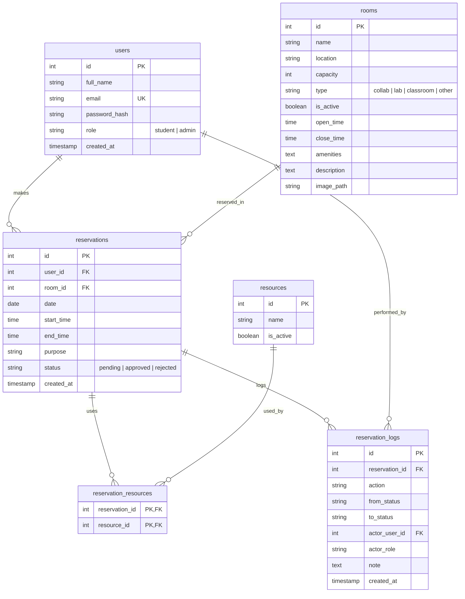

# 🏫 CollabSpace: UM Room Reservation System

[](https://www.php.net/)
[](https://www.mysql.com/)
[](https://getbootstrap.com/)
[](https://opensource.org/licenses/MIT)

**CollabSpace** is a modern, lightweight, and responsive web-based Room Reservation System specifically tailored for the **University of Mindanao (UM)**. It allows students to reserve collaboration rooms, computer labs, and classrooms by the hour, while providing administrators with a powerful dashboard to manage rooms, user accounts, system announcements, and audit logs.

Designed with **glassmorphism aesthetics**, smooth micro-animations, and a highly secure backend, CollabSpace simplifies campus facility bookings without requiring complex Javascript framework overhead.

---

## 🚀 Key Features

### 👤 Student / User Portal
*   **Dynamic Room Booking Form**: Select rooms and date with a visual grid of available hourly slots (8:00 AM – 9:00 PM).
*   **Live Room Preview**: Real-time room detail updates (location, capacity, type, amenities, description, and photo) directly on selection.
*   **My Reservations Dashboard**: Track booking status (Pending, Approved, Rejected, Canceled) and easily cancel future bookings.
*   **Interactive Room Gallery**: Staggered grid view of active rooms with hover details, zoom transitions, and instant search filter.
*   **Announcements Panel**: Real-time updates on room availability, maintenance, or campus events.

### 🔑 Administrator Portal
*   **Executive KPI Dashboard**: Quick-glance counters for rooms, users, today's bookings, and a list of pending approval requests.
*   **Room CRUD Management**: Easily add, edit, or delete rooms, complete with custom image uploads, type settings, and hours configuration.
*   **User Account CRUD**: Management of student and admin accounts with automatic temporary password generation.
*   **Calendar & Approvals Manager**: Unified view of reservations with one-click approve/reject actions and optional administrative feedback notes.
*   **Announcements Manager**: Control visibility of updates using custom severity levels (Info, Update, Notice, Important) and visibility date windows.
*   **Resource Tracking**: Track amenities and resources (e.g., Projectors, Whiteboards, HDMI Cables) linked to reservations.
*   **Audit Trail (Transactions)**: Detailed, paginated transaction log tracking all state changes, who performed them, notes, and timestamps.

### 🛡️ Security & Performance Highlights
*   **Robust CSRF Guards**: Token validation on all state-changing `POST` requests.
*   **Bcrypt Hashing**: Secure password storage utilizing PHP's native bcrypt implementation.
*   **SQL Injection Prevention**: Exclusive usage of PDO prepared statements with strict parameter binding.
*   **XSS Mitigation**: Strict sanitization of all user-generated content rendered in HTML.
*   **Database Transaction Isolation**: Ensures data integrity during reservation creation and resource linkage.
*   **Zero-Overhead CSS/JS**: High-performance rendering utilizing modern CSS variables, transitions, and vanilla Javascript.

---

## 🛠️ Technology Stack

*   **Backend**: PHP 7.4+ (Standard PDO, Session, File System operations)
*   **Database**: Dual-engine support:
    *   **MySQL/MariaDB** (Primary production)
    *   **SQLite** (Development fallback / Zero-config setup)
*   **Frontend UI/UX**:
    *   **Bootstrap 5.3.3** (Responsive styling & components)
    *   **Bootstrap Icons 1.11.3**
    *   **AOS (Animate On Scroll) 2.3.4** (Micro-animations)
*   **Web Server**: PHP Built-in Server with a custom `router.php`

---

## 📂 Project Structure

```
UM-Room-Reservation-System/
├── config/
│   ├── app.php             # Core app configs (Base URL, timezone, session name)
│   └── db.php              # PDO configuration with auto-fallback and SQLite compatibility
├── lib/
│   ├── auth.php            # Session validation, login helper, role guards
│   ├── csrf.php            # CSRF token generation and verification
│   ├── helpers.php         # Utility functions (XSS protection, redirects, flash messages)
│   ├── validator.php       # Server-side inputs validator (email, min length)
│   └── mailer_dummy.php    # Stub mailer that logs to local mail.log
├── sql/
│   ├── schema.sql          # DB layout (Users, Rooms, Reservations, Logs, etc.)
│   └── seed.sql            # Seed data (Demo admin, sample rooms/resources)
├── public/                 # User-facing pages (views)
│   ├── index.php           # Landing Page
│   ├── login.php / register.php
│   ├── dashboard_user.php  # Student Dashboard
│   ├── dashboard.php       # Admin Dashboard
│   ├── rooms_gallery.php   # Visual room browsing
│   └── api/
│       └── available_slots.php # Live slots check JSON API
├── actions/                # POST action controllers (business logic)
│   ├── auth_login.php
│   ├── reservation_create.php
│   └── room_crud.php (etc.)
├── assets/                 # Static assets (CSS, JS, Images)
│   ├── css/style.css       # Custom styles, variables, transitions
│   └── js/app.js           # Client-side helpers (ripple effects, alert auto-fade)
├── router.php              # Custom router for PHP built-in server
└── database.db             # Local SQLite database (Auto-generated)
```

---

## 📊 Database Schema



---

## ⚙️ Installation & Setup

CollabSpace includes a **dual-database driver** setup. If it cannot connect to a local MySQL instance, it will automatically fallback to SQLite and bootstrap the schema and seed data into a local `database.db` file.

### Option A: Using PHP's Built-in Server (Recommended - Quickest)
No XAMPP or MySQL setup is required. The system will run instantly using SQLite fallback.

1.  **Clone the Repository**:
    ```bash
    git clone https://github.com/airo-coder/UM-Room-Reservation-System.git
    cd UM-Room-Reservation-System
    ```
2.  **Start the Local Server**:
    Run the custom router using your local PHP binary:
    ```bash
    php -S 127.0.0.1:8000 router.php
    ```
3.  **Access the App**:
    Open your browser and navigate to:
    **[http://127.0.0.1:8000/](http://127.0.0.1:8000/)**

---

### Option B: Using XAMPP / Apache + MySQL
If you prefer running a traditional MySQL database:

1.  **Move the Folder**:
    Move/clone the project folder into your XAMPP web root (`C:/xampp/htdocs/` or `/Applications/XAMPP/htdocs/`).
    Rename the directory to `pl_final_project`.
2.  **Import the Schema**:
    *   Open **phpMyAdmin** (`http://localhost/phpmyadmin/`).
    *   Create a database named `cst5l_db`.
    *   Import the SQL schema from `sql/schema.sql` and seed data from `sql/seed.sql`.
3.  **Configure Database (Optional)**:
    Open `config/db.php` and verify the MySQL connection settings:
    ```php
    $DB_HOST = 'localhost';
    $DB_NAME = 'cst5l_db';
    $DB_USER = 'root';
    $DB_PASS = '';
    ```
4.  **Access the App**:
    Navigate to:
    **[http://localhost/pl_final_project/public/index.php](http://localhost/pl_final_project/public/index.php)**

---

## 🔑 Default Credentials

To explore the system, you can use the default seeded accounts:

*   **Administrator Account**:
    *   **Email**: `admin@example.com`
    *   **Password**: `admin123`
*   **Student / User Account**:
    You can easily register a new student account using the **Create Account** button on the landing page.

---

## 🤝 Contributing
Feel free to open issues or submit pull requests to improve the system's design, feature set, or database migrations.

---

## 👥 Contributors
*   **airo-coder** (Lead Developer)
*   **algernon-coder** (Co-author)
